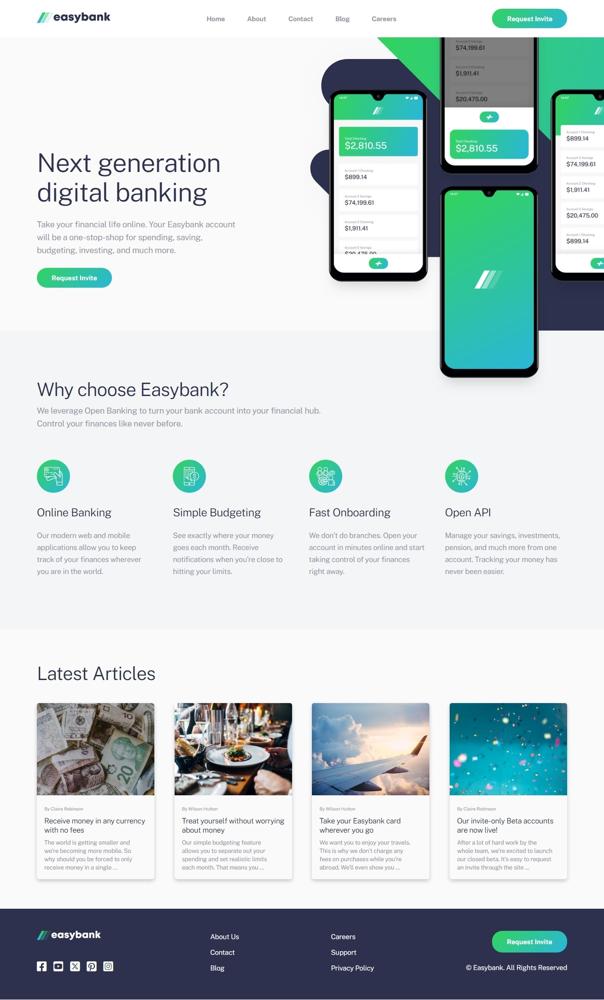

# Frontend Mentor - Easybank landing page

  

This is a solution to the [Easybank landing page challenge on Frontend Mentor](https://www.frontendmentor.io/solutions/easybank-landing-page-solution-nFXi3QY-DE). Frontend Mentor challenges help us to improve our coding skills by building realistic projects.   

## Built with

- Semantic HTML5 markup
- SCSS
- Flexbox
- Javascript
- Mobile-first workflow

Preview it here - [Blogr landing page](https://easybanks-landing-page-1.netlify.app/)   

## Author

- Website - [Idris](https://id-dev3.github.io/)
- Frontend Mentor - [@id-dev3](https://www.frontendmentor.io/profile/id-dev3)
- Twitter - [@id_dev3](https://www.twitter.com/id_dev3)
